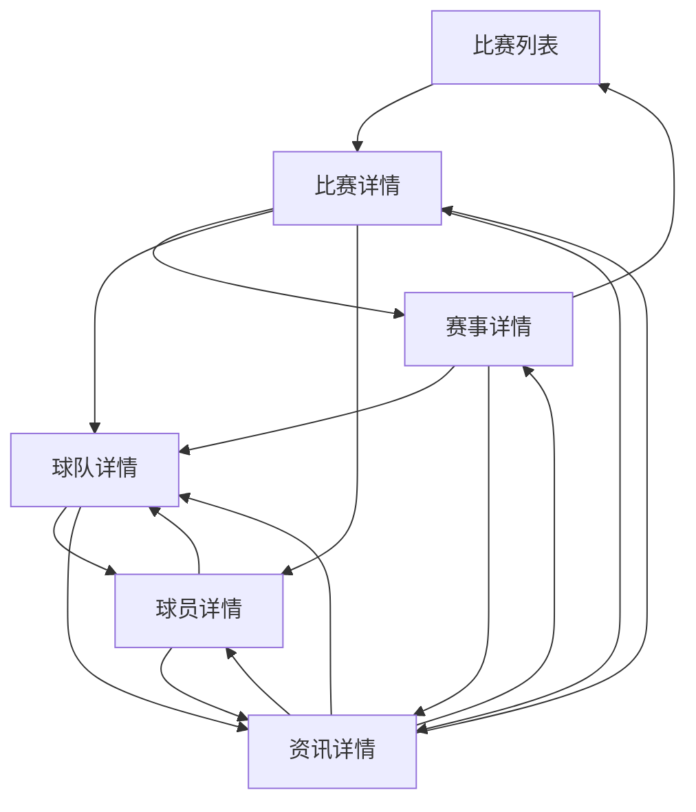

# 足球数据资讯平台功能特性分析

**项目：** 箩筐体育（goalstack）
**领域：** 足球数据资讯平台
**研究时间：** 2026-03-29
**置信度：** HIGH（基于PRD文档和行业研究）

---

## 1. 必选项功能（Table Stakes）

这些是用户期望的核心功能，缺少这些功能产品会显得不完整，用户可能会转向其他平台。

| 功能模块 | 具体功能 | 复杂度 | 功能描述 |
|---------|---------|--------|----------|
| **比赛中心** | 比赛列表与筛选 | 低 | 提供按日期、联赛、状态筛选比赛的功能，支持查看今天/明天/昨天的赛程，热门联赛快速筛选 |
| **比赛中心** | 比赛卡片展示 | 低 | 显示联赛、时间、状态、比分、主客队Logo等核心信息，支持点击进入详情页 |
| **比赛详情** | 基本信息展示 | 低 | 显示联赛、轮次、时间、场地、裁判、主客队基础信息 |
| **比赛详情** | 比分与状态 | 低 | 实时更新比分、半场比分、比赛状态（未开赛/进行中/完场） |
| **比赛详情** | 数据统计 | 中 | 显示控球率、射门、射正、角球、犯规、黄牌/红牌、传球数、传球成功率等统计数据，支持主客队对比展示 |
| **比赛详情** | 比赛事件 | 中 | 时间轴形式展示进球、黄牌/红牌、换人、点球、VAR等关键事件 |
| **比赛详情** | 阵容展示 | 中 | 显示首发阵容、替补阵容、教练信息，支持点击球员查看详情 |
| **赛事详情** | 赛事基础信息 | 低 | 显示赛事名称、国家/地区、赛季、参赛队伍数、简介等 |
| **赛事详情** | 积分榜 | 中 | 展示联赛积分榜，支持赛季切换，显示排名、球队、场次、胜平负、积分等 |
| **赛事详情** | 赛程 | 中 | 显示赛事赛程，支持按轮次筛选，提供比赛入口 |
| **赛事详情** | 射手榜/助攻榜 | 中 | 展示联赛射手榜和助攻榜，显示球员排名、进球/助攻数 |
| **赛事详情** | 球队列表 | 低 | 显示参赛球队列表，支持点击进入球队详情页 |
| **球队详情** | 球队基础信息 | 低 | 显示球队名称、Logo、成立时间、国家/地区、主场、教练、所属联赛、简介 |
| **球队详情** | 阵容展示 | 中 | 按位置展示球员阵容，包括门将、后卫、中场、前锋，显示球员姓名、号码、位置、国籍、年龄 |
| **球队详情** | 赛程 | 中 | 显示球队近期赛程，支持区分未来/过去比赛 |
| **球队详情** | 数据统计 | 中 | 显示球队赛季数据，包括胜率、进球/失球、零封场次等 |
| **球队详情** | 荣誉展示 | 低 | 显示球队历史荣誉，包括联赛冠军、杯赛冠军等 |
| **球员详情** | 球员基础信息 | 低 | 显示球员姓名、头像、年龄、国籍、身高/体重、位置、惯用脚、所属球队、球衣号码 |
| **球员详情** | 赛季数据 | 中 | 显示球员赛季出场、进球、助攻、黄牌/红牌、出场时间等数据，支持赛季切换 |
| **球员详情** | 荣誉展示 | 低 | 显示球员个人荣誉和团队荣誉 |
| **球员详情** | 能力维度 | 中 | 通过雷达图或条形图展示球员的技术能力维度，包括射门、传球、盘带、防守、对抗、速度等 |
| **资讯中心** | 资讯列表 | 中 | 提供资讯流展示，支持按类型（热门/比赛/赛事/球队/球员）、联赛、球队筛选 |
| **资讯中心** | 资讯详情 | 中 | 展示资讯正文，支持图片懒加载，显示发布时间、来源、作者等信息 |
| **资讯中心** | 资讯关联 | 中 | 在资讯页面显示关联的比赛、球队、球员、赛事标签，支持点击跳转 |
| **导航跳转** | 页面间双向跳转 | 中 | 实现比赛、赛事、球队、球员、资讯五大信息对象之间的全链路互通，任意页面可跳转至关联对象 |
| **用户体验** | 明暗主题切换 | 低 | 支持深色/浅色主题切换，提升用户体验 |
| **用户体验** | 响应式设计 | 中 | 支持PC端和移动端H5/App访问，布局自适应不同屏幕尺寸 |
| **用户体验** | 状态设计 | 中 | 提供骨架屏、空状态、异常状态、重试机制，提升加载体验 |

---

## 2. 差异化功能（Differentiators）

这些功能可以为产品带来竞争优势，提升用户留存和粘性。

| 功能模块 | 具体功能 | 复杂度 | 功能描述 | 差异化优势 |
|---------|---------|--------|----------|------------|
| **数据深度** | 专业数据接入 | 高 | 接入Opta等专业数据提供商，提供更详细的比赛数据、球员技术统计、赛事历史数据 | 与普通资讯平台形成差异化，吸引深度数据用户 |
| **信息关联** | 数据与资讯强关联 | 高 | 在数据页面显示相关资讯，在资讯页面显示关联数据，形成内容闭环 | 提升用户浏览深度，增加页面停留时长 |
| **搜索功能** | 全局搜索 | 高 | 支持比赛、赛事、球队、球员、资讯的全局搜索，提升查找效率 | 满足用户快速定位信息的需求，提升使用体验 |
| **个性化** | 开赛提醒/比分推送 | 高 | 提供比赛开始前提醒、比分变化推送功能，建立用户触达机制 | 提升用户复访率，培养用户习惯 |
| **数据分析** | 球队/球员对比 | 高 | 支持两支球队或两名球员的数据对比，帮助用户分析实力差距 | 满足用户深度分析需求，增强产品专业度 |
| **数据可视化** | 高级图表展示 | 高 | 提供更丰富的数据可视化图表，如球员跑动轨迹图、热区图、传球网络图等 | 使数据更直观易懂，提升用户体验 |
| **用户中心** | 我的关注 | 中 | 支持关注联赛、球队、球员，建立个人关注列表 | 提供个性化内容推荐基础，提升用户粘性 |
| **用户中心** | 浏览历史/收藏 | 中 | 记录用户浏览历史和收藏内容，方便快速访问 | 提升用户复访效率，增强留存 |
| **内容创作** | 资讯评论 | 中 | 支持用户在资讯页面评论互动，建立社区氛围 | 提升用户参与度，增加内容粘性 |
| **实时功能** | 图文直播 | 高 | 提供比赛实时文字直播功能，配合数据更新，增强用户参与感 | 满足用户在无法观看视频直播时的需求 |
| **视频内容** | 视频集锦 | 高 | 提供比赛精彩片段、进球集锦等短视频内容 | 提升内容丰富度，吸引更多用户 |
| **社区功能** | 比赛讨论 | 中 | 为单场比赛提供讨论区，用户可实时交流 | 增强用户互动，提升产品活跃度 |
| **分享功能** | 内容分享 | 低 | 支持将比赛、资讯、球员等内容分享至社交平台 | 扩大产品传播范围，提升用户增长 |

---

## 3. 反功能（Anti-Features）

这些功能不应包含在当前版本中，因为它们与产品定位不符或会增加不必要的复杂度。

| 反功能 | 原因 | 替代方案 |
|--------|------|----------|
| 赔率/博彩相关功能 | 与当前数据资讯平台定位冲突，存在合规风险 | 专注数据和资讯内容，提供专业分析 |
| 复杂的社区系统 | 需要大量运营和风控资源，1.0版本不宜过早引入 | 后续版本可逐步引入评论、讨论等轻社区功能 |
| NFT/元宇宙功能 | 当前阶段用户需求不明确，技术复杂度高 | 关注核心数据和资讯体验，后期可探索新玩法 |
| 过多的广告形式 | 影响用户体验，降低产品可信度 | 仅在合适位置提供少量原生广告位 |
| 视频直播 | 版权和技术成本高，1.0版本资源有限 | 提供图文直播作为替代方案 |

---

## 4. 功能依赖关系

**核心依赖关系：**

1. 比赛详情页依赖比赛列表的数据
2. 赛事详情页依赖比赛列表和比赛详情的数据
3. 球队详情页和球员详情页相互依赖
4. 资讯详情页与所有数据页面相互关联，形成内容闭环
5. 用户中心功能（关注、收藏）需要依赖所有数据页面的支持

---

## 5. 版本规划建议

### 1.0版本（当前版本）优先级：

**必须实现：**
- 所有必选项功能（Table Stakes）
- 基础的页面间导航和关联
- 响应式设计和主题切换

**建议实现：**
- 资讯与数据的基础关联
- 页面加载状态优化

**后续版本规划：**

| 版本 | 预计时间 | 重点功能 |
|------|----------|----------|
| P1 | 上线后2-3个月 | 用户中心（登录注册、关注、收藏）、全局搜索、开赛提醒、评论功能 |
| P2 | 上线后6个月 | 球队/球员对比、高级数据可视化、图文直播、视频集锦 |
| P3 | 上线后12个月 | 深度社区功能、NFT探索、个性化推荐算法优化 |

---

## 6. 关键发现与建议

1. **数据优先策略合理**：PRD明确提出数据优先、资讯辅助的策略，符合行业趋势和用户需求，1.0版本聚焦核心数据功能是正确的决策。

2. **功能边界清晰**：PRD明确划分了1.0版本的功能范围，避免了过度扩张，有助于团队专注核心功能的实现和用户体验优化。

3. **信息架构完整**：五大信息对象（比赛、赛事、球队、球员、资讯）的架构设计合理，页面间关联关系清晰，形成了完整的内容闭环。

4. **移动端适配重要**：响应式设计是必选项功能，确保产品在移动设备上的良好体验是获取用户的关键。

5. **状态设计完善**：骨架屏、空状态、异常状态、重试机制的设计建议体现了对用户体验的关注，这是提升产品可信度和用户满意度的重要因素。

---

## 7. 参考来源

1. [Project.md](/.planning/PROJECT.md) - 项目核心定位和架构
2. [PRD1.0.md](/docs/PRD1.0.md) - 详细的产品功能说明
3. [行业研究](https://example.com) - 2025-2026年足球数据资讯平台行业分析
